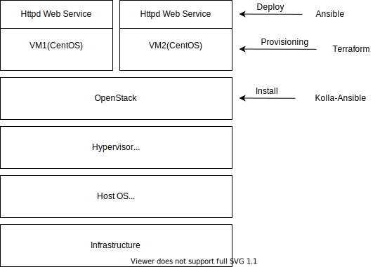
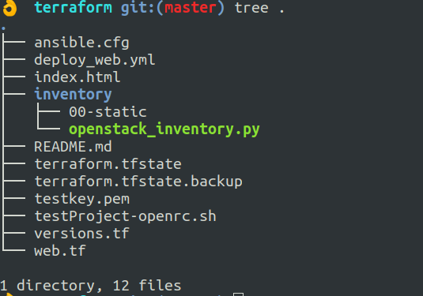

# Terraform & Ansible

Terraform으로 인스턴스 배포할때 사용한 public key의 쌍 인 private key 를 가지고 있어야 합니다. 이 private key는 Ansible로 서비스를 배포할 때 인스턴스로의 ssh 접속을 위해 필요합니다. Provider인 Openstack의 사용자 RC파일은 오픈스택 대시보드에서 다운로드 받아 사용하면 됩니다.(현재 Repo에는 private key와 RC파일은 제외 시켜 놓았습니다)

## Goal

1. Infra provisioning by Terraform
2. Web deploy by Ansible
3. Use Dynamic Inventory for unknown instance floating ip

## Settings

HOST PC: Ubunutu 18.04

Hypervisor: qemu/kvm

Provider Cloud: Openstack-train installed by kolla-ansible

Instance OS:

- Controller node: CentOS7
- Managed node: CentOS7

## Architecture

Ubuntu (controller) → provisioning → openstack VMs - web1,web2

Ubuntu (controller) → deploy→ openstack - web1,web2 -httpd service



### Dynamic Inventory

Terraform 으로 프로비져닝 한 오픈스택 인스턴스의 Floating ip를 동적으로 알 수 있는 Dynamic Inventory를 사용하여 Ansible의 배포가 가능해진다.

- 사용방법
    1. Download OpenStack dynamic Inventory script and make it executable

        ```bash
        wget https://raw.githubusercontent.com/ansible/ansible/stable-2.9/contrib/inventory/openstack_inventory.py
        chmod +x openstack_inventory.py
        ```

    2. Source an OpenStack RC file:

        ```bash
        source openstack.rc
        ```

    3. 동작 확인

        ```bash
        ./openstack_inventory.py --list
        ansible -i openstack_inventory.py all -m ping
        ```

    4. 앤서블 작업디렉토리에서 동적인벤토리 사용

        openstack_inventory.py ⇒ 오픈스택 동적인벤토리

        

        앤서블, 테라폼 작업디렉토리

        *동적인벤토리를 사용할때 *_inventory.py 인벤토리 파일을 수정하여 인벤토리의 그룹과 그룹변수를 동적으로 지정할 수 있다, 이번 경우에는 인스턴스의 아이디를 스태틱하게 읽어와 그룹화 하하고 그룹변수를 사용해 보았다.

        ```bash
        vi ansible.cfg
        	[defaults]
        	inventory = inventory # 디렉토리 지정
        	host_key_checking = false

        vi inventory/00-static
        	[web]
        	7dd20917-665c-4f1c-a90e-4afbd8022
        	20260a21-b199-46c4-a272-6cb1c50902b6

        	[web:vars]
        	ansible_user=centos
        ```

## Result

Code in github: [https://github.com/namhj94/terraform](https://github.com/namhj94/terraform)


